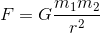
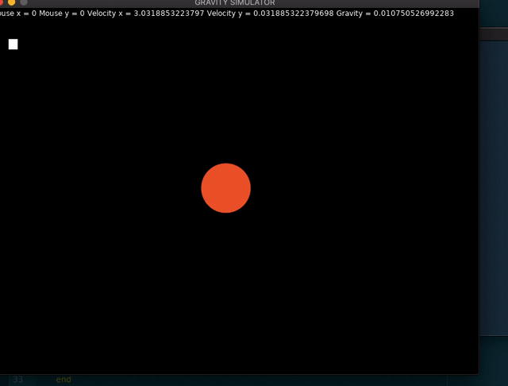

# gravity-lua

a simple gravity simulator made on love2D, a game framework for Lua (work in progress.) i used the equation  as a basis for the simulation. the masses are simply treated as coefficients to scale up/down the gravitational force. the gravitational constant 'G' can be varied, as can initial velocity (of the satellite) The euclidean distance is computed and its reciprocal is multiplied to the equation every frame. 

A demo with random parameters. 

